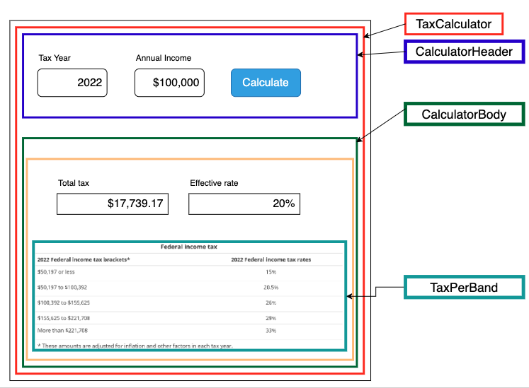

# Component Hierarchy

- TaxCalculator
  -  CalculatorHeader
  -  CalculatorBody
    -  TaxResults
       - TaxPerBand



# Getting Started
In order to run the Tax Calculator app, API server should be running locally. 

## Set up local API
please follow these instructions to set up the local API server.

```bash
docker pull ptsdocker16/interview-test-server
docker run --init -p 5000:5000 -it ptsdocker16/interview-test-server
```

Navigate to [http://localhost:5000](http://localhost:5000). You should be greeted with this set of instructions, and access to the different available endpoints. The following are the relevant endpoints:

* [/tax-calculator/](http://localhost:5000/tax-calculator/) - endpoint to develop against
* [/tax-calculator/tax-year/2022](/tax-calculator/tax-year/2022) - endpoint this app is testing

## Running the client app
### `yarn start`

Runs the app in the development mode.\
Open [http://localhost:3000](http://localhost:3000) to view it in the browser.

The page will reload if you make edits.\
You will also see any lint errors in the console.

